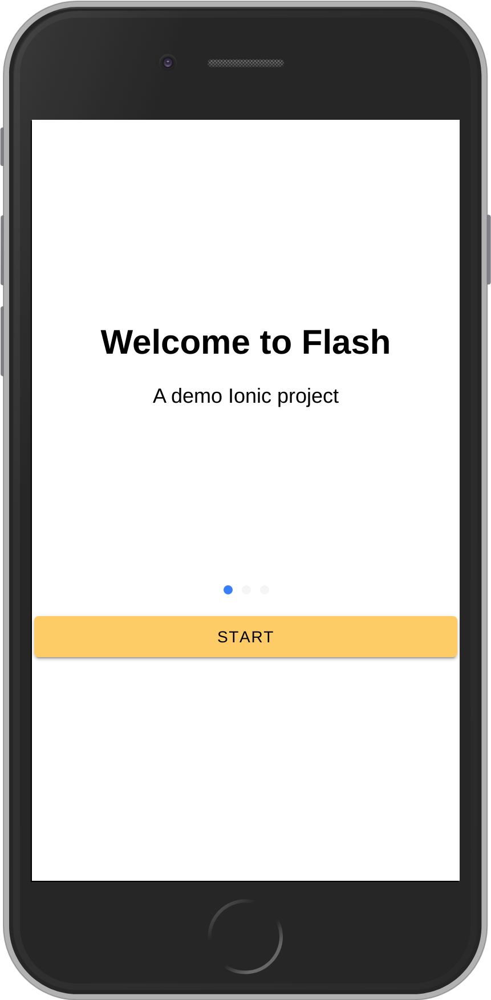
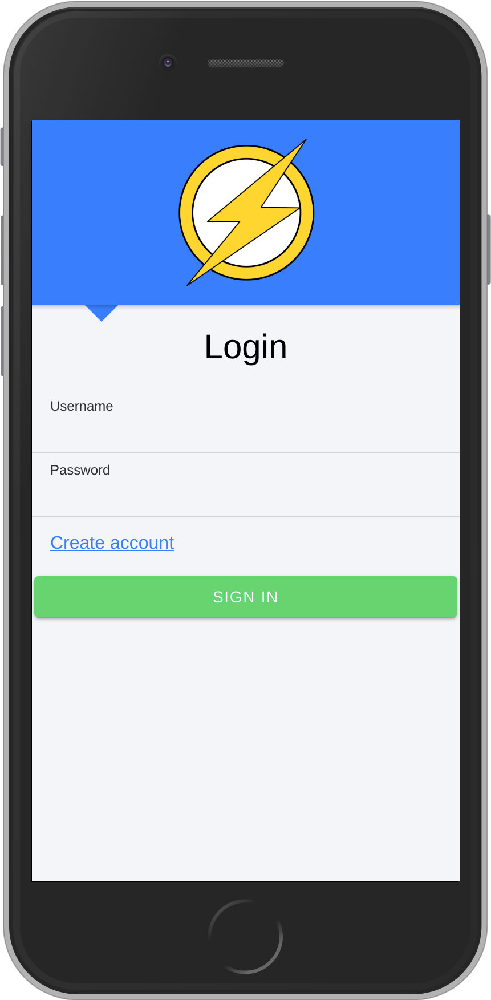
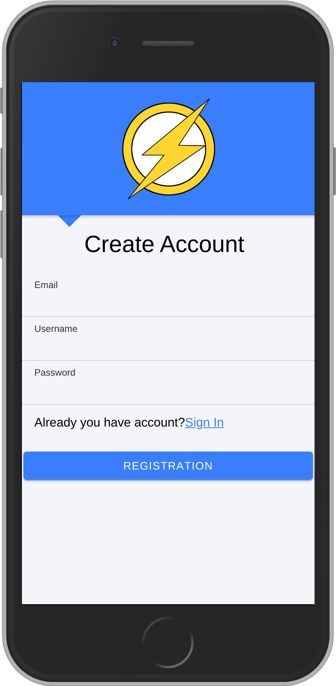
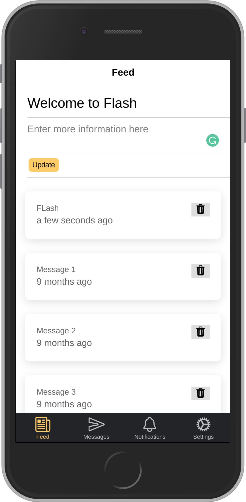
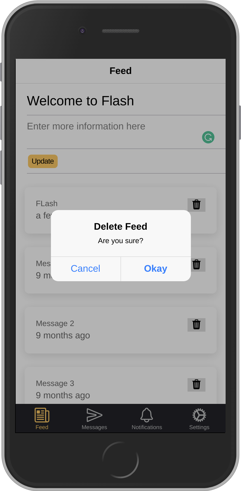

# Flash
ionic_project 

---
## About

* Welcome Page with Login, Sign Up and Home Tabs using Capacitor.
* Using Mock REST Backend Server for Angular
* Update and Delete Records with RxJS.
* Restful API User Authentication Login and Signup using Guard and Resolver
* You can import the project to any of the front-end applications like Angular, React, Ionic and VueJS projects.

---

## Prerequisites

1. Front End:
    * Ionic Framework 
    * Scss
    * Javascript
    * Html
    * Css
2. Back End:
    * Mock REST
    
## Configuration and Installat

1. Prerequsities:

    * First, use the following commands to install NPM and Node.js on your system. In below commands, the first command will         install some required packages on the system. The second command will add PPA for node.js to your system.  
    
    ```
    sudo apt-get install python-software-properties
    curl -sL https://deb.nodesource.com/setup_10.x | sudo -E bash -
    sudo apt-get install nodejs 
 
    ```
 2. Install Cordova:     
    
     * Now use the following command to install Cordova on your system using npm command. It will install all other required        node modules on your system.
     
     ```
     sudo npm install -g cordova
     
     ```
 3. Install Ionic on Linux:     
 
     * Ionic provides and commands line utility for creating packages, build and start applications. Use NPM command to              install the Ionic framework on your system.
     
     ```
     sudo npm install -g ionic
     
     ```
## Screenshots of the App:
    
1. Ionic Slides.
    
    ---

    
    
    ---

2. Welcome Page with Login, Sign Up and Home Tabs using Capacitor. 

    ---

    
    
    ---

3. Sign Up Page.
     
    ---
    
    

    ---

4. Feed Page.

    ---

    

    ---

5. Update and Delete Records with RxJS.

    ---

    

    ---

    
